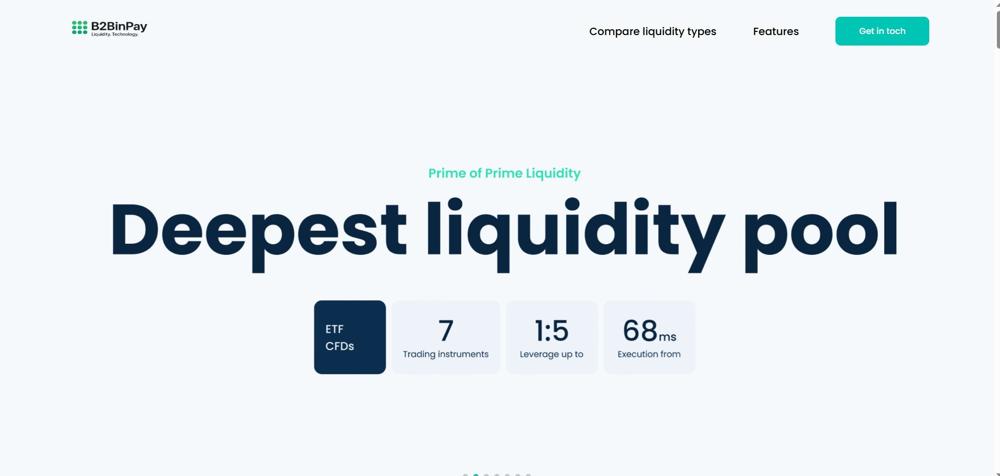

# Broker Landing Page - WordPress Theme

A custom WordPress theme developed for a financial technology landing page. The primary goal is to present liquidity and brokerage solutions to potential clients and capture leads through an advanced, user-friendly contact form.

Built with a focus on modern design, interactivity, and ease of content management.



## Core Features & Technologies

### 1. Interactive User Experience

- **Dynamic Sliders**: Integrates Swiper.js for engaging visual elements, including a main hero slider and carousel for showcasing liquidity providers
- **Custom Animations & Transitions**: CSS animations enhance user interaction and provide smooth browsing experience
- **SVG Sprite System**: All icons managed through a single `sprite.svg` file, loaded inline for optimal performance and easy CSS styling

### 2. Multi-Step Lead Generation Form

The cornerstone of the project is a sophisticated two-step form built to maximize conversion rates:

- **Contact Form 7 Backend**: Form logic and mail handling managed by the popular Contact Form 7 plugin
- **jQuery Enhancement**: Custom `wizard-form.js` script handles multi-step navigation, validation, and interactive elements
- **Custom-Styled Inputs**: All form controls, including checkboxes and radio buttons, are custom-styled to match the theme design
- **Interactive Budget Slider**: Intuitive budget selection tool implemented using the noUiSlider library
- **International Phone Input**: The intl-tel-input library provides user-friendly phone number field with country flag selection and validation

### 3. Content Management

- **Advanced Custom Fields (ACF)**: Flexible content management allowing administrators to easily update key sections without touching code:
  - Slider images and content
  - Lists of partners and liquidity venues
  - Text and titles in various feature sections
- **Customizable Logos**: Separate logos for header and footer, manageable through WordPress Customizer

### 4. Development Workflow & Build Process

- **Gulp.js Automation**: Automated development tasks including:
  - Compiling SCSS/SASS into CSS
  - Minifying CSS and JavaScript files for production
  - Image optimization
  - Live reloading with BrowserSync for efficient development feedback
- **Modular Structure**: Organized into logical template-parts for better maintainability and code readability
- **Code Quality**: Prettier enforces consistent code style across the project

## Project Structure

```
goit/
├── assets/
│   ├── css/          # Compiled CSS files
│   ├── img/          # Image assets
│   ├── js/           # JavaScript files
│   └── sprite.svg    # SVG icon sprite
├── inc/              # Theme includes (e.g., post types, scripts)
├── template-parts/   # Reusable template files for sections
├── node_modules/     # (Ignored by Git) NPM dependencies
├── .gitignore        # Specifies files to be ignored by Git
├── footer.php
├── functions.php     # Theme setup and custom functionality
├── gulpfile.js       # Gulp automation tasks
├── header.php
├── index.php
├── package.json      # Project metadata and dependencies
├── screenshot.png    # Theme thumbnail for WordPress admin
└── style.css         # Theme information header
```

## Installation

1. Clone the repository to your WordPress themes directory
2. Install dependencies: `npm install`
3. Install required WordPress plugins:
   - Contact Form 7
   - Advanced Custom Fields (ACF)
4. Activate the theme in WordPress admin
5. Configure ACF fields and customize content

## Development

- Run `gulp` to start the development server with live reloading
- Run `gulp build` to create production-ready files
- All SCSS files are compiled automatically
- Images are optimized during the build process

## Technologies Used

- **WordPress** - Content Management System
- **PHP** - Server-side scripting
- **SCSS/SASS** - CSS preprocessing
- **JavaScript/jQuery** - Client-side interactivity
- **Gulp.js** - Build automation
- **Swiper.js** - Interactive sliders
- **noUiSlider** - Budget slider component
- **intl-tel-input** - International phone input
- **Contact Form 7** - Form handling
- **Advanced Custom Fields** - Content management
- **BrowserSync** - Live reloading

## Author

**Valeria [Your Last Name]**

- Telegram: [@ValeriyaJ]
- LinkedIn: [linkedin.com/in/valeriia-muntyan/](https://www.linkedin.com/in/valeriia-muntyan/)
